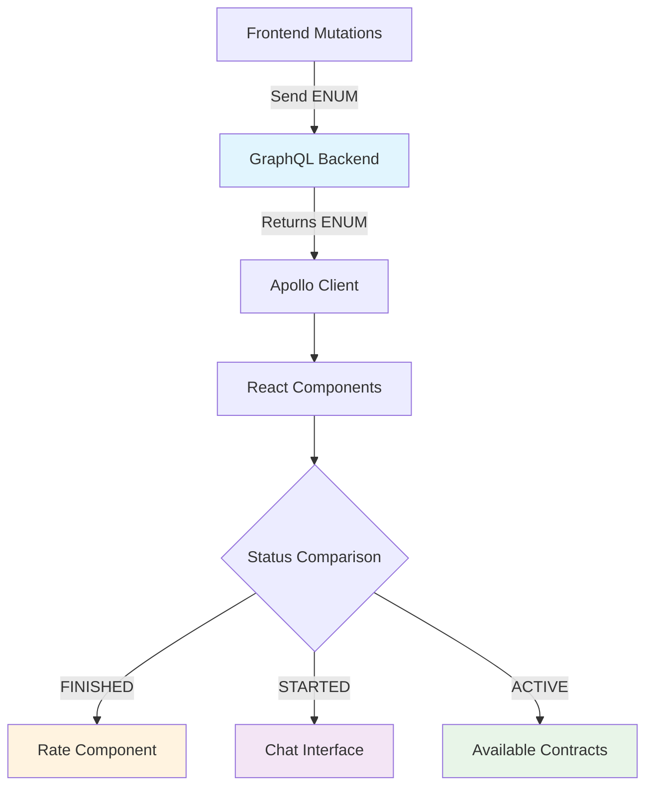

# Chat Status Enum Update Design

## Overview

This design addresses the migration from string-based chat status values to enum-based status values in the chat application. The backend has been updated to use enum values (`ACTIVE`, `STARTED`, `FINISHED`) instead of string literals, and this change needs to be reflected throughout the frontend application.

## Current State Analysis

### Identified Status String Usage

The current codebase uses the following string-based status values:
- `"active"` - for contracts and active chats
- `"started"` - for chats that have begun
- `"finished"` - for completed chats  
- `"ended"` - for terminated chats

### Files Requiring Updates

Based on codebase analysis, the following locations contain hardcoded status strings:

1. **GraphQL Queries (`/src/queries.js`)**:
   - `GET_WEBSITE_CONTRACTS` query: `status: "active"`
   - `END_CHAT` mutation: `status: "finished"`

2. **Component Logic**:
   - `/src/App.js`: `data.chat.status === "finished"`
   - `/src/ChatContainer.js`: `chatStatusData?.chat?.status === 'ended'`
   - `/src/ChatStatusMonitor.js`: `chatData.status === 'started'`

3. **Utility Functions (`/src/utils.js`)**:
   - `filterActiveContracts()`: `contract.status === 'active'`

## Status Enum Mapping

The string-to-enum mapping is as follows:

| Current String | New Enum Value | Context |
|----------------|----------------|---------|
| `"active"` | `ACTIVE` | Contract status |
| `"started"` | `STARTED` | Chat status |
| `"finished"` | `FINISHED` | Chat status |
| `"ended"` | `FINISHED` | Chat status (unified) |

## Architecture Changes

### GraphQL Query Updates

#### Before:
```graphql
query {
  website(id: $websiteId) {
    contracts(condition: {status: "active"}) {
      id
      status
    }
  }
}
```

#### After:
```graphql
query {
  website(id: $websiteId) {
    contracts(condition: {status: ACTIVE}) {
      id
      status
    }
  }
}
```

### Status Comparison Logic Updates

#### Before:
```javascript
if (data.chat.status === "finished") {
  return(<Rate chat={data.chat} setCreate={setCreate} />)
}
```

#### After:
```javascript
if (data.chat.status === 'FINISHED') {
  return(<Rate chat={data.chat} setCreate={setCreate} />)
}
```

## Implementation Strategy

### Phase 1: Constants Definition
Create status enum constants to ensure consistency across the application:

```javascript
// src/constants/chatStatus.js
export const CHAT_STATUS = {
  ACTIVE: 'ACTIVE',
  STARTED: 'STARTED', 
  FINISHED: 'FINISHED'
};

export const CONTRACT_STATUS = {
  ACTIVE: 'ACTIVE'
};
```

### Phase 2: GraphQL Updates
Update all GraphQL queries and mutations to use enum values instead of string literals:

1. **GET_WEBSITE_CONTRACTS Query**
   - Change `status: "active"` to `status: ACTIVE`

2. **END_CHAT Mutation**  
   - Change `status: "finished"` to `status: FINISHED`

### Phase 3: Component Logic Updates
Update status comparison logic in React components:

1. **App.js**
   - Replace `"finished"` with `FINISHED` enum

2. **ChatContainer.js**
   - Replace `'ended'` with `FINISHED` enum (unified status)

3. **ChatStatusMonitor.js**
   - Replace `'started'` with `STARTED` enum

### Phase 4: Utility Function Updates
Update utility functions to use enum values:

1. **utils.js**
   - Update `filterActiveContracts()` to use `ACTIVE` enum

## Data Flow Impact



## Risk Assessment

### Low Risk Changes
- Constant definitions
- GraphQL query parameter updates
- Direct string comparisons in components

### Medium Risk Changes  
- Status display logic that might show enum values to users
- Subscription handlers that depend on status changes

### Mitigation Strategies
1. **Backward Compatibility**: Implement fallback logic during transition period
2. **Testing**: Comprehensive testing of all status-dependent workflows
3. **Gradual Rollout**: Update queries first, then component logic
4. **Status Display**: Ensure enum values are properly formatted for user display

## Status Display Considerations

The current implementation includes status display logic:

```javascript
const status = chatData?.chat?.status 
  ? chatData.chat.status.charAt(0).toUpperCase() + chatData.chat.status.slice(1)
  : "Started"
```

This logic may need updates to handle enum values appropriately, potentially requiring a mapping function:

```javascript
const getDisplayStatus = (enumStatus) => {
  const statusMap = {
    'STARTED': 'Started',
    'FINISHED': 'Finished', 
    'ACTIVE': 'Active'
  };
  return statusMap[enumStatus] || 'Started';
};
```

## Testing Strategy

### Unit Testing
- Test all status comparison logic with new enum values
- Verify GraphQL queries return expected enum values
- Test utility functions with enum inputs

### Integration Testing  
- End-to-end chat flow with status transitions
- Contract filtering with ACTIVE enum
- Status subscription handling

### Regression Testing
- Verify existing chat workflows continue functioning
- Test status display in UI components
- Validate backwards compatibility during transition

## Rollback Plan

In case issues arise:
1. Revert GraphQL queries to use string literals
2. Restore original status comparison logic
3. Remove enum constants
4. Deploy previous version

The modular nature of these changes allows for selective rollback of individual components if needed.